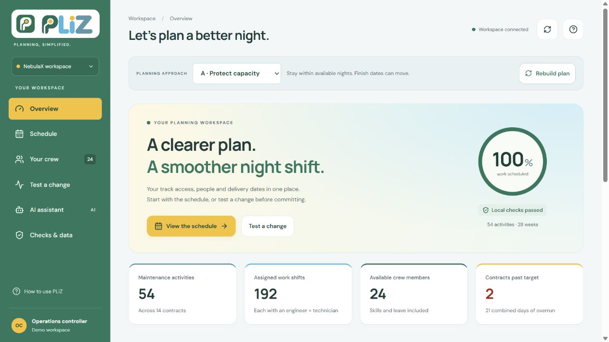
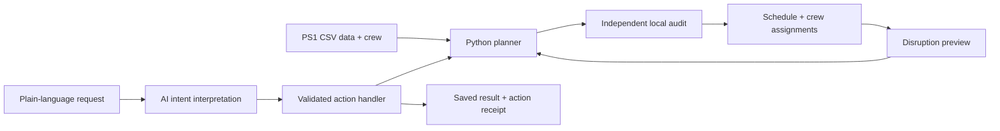

# PLiZ — Planning, simplified.

**A railway maintenance workspace that turns competing track-access requests into crew-assigned schedules, then replans when conditions change.**

Built for [NebulaX Problem Statement 1: Railway Track Access Optimisation](https://github.com/aochinwen/NebulaX-Hackathon-ProblemStatement/blob/main/PS1/PS1_README.md).

[Repository](https://github.com/Pskm12E/Nus_Hackathon) · [Deployment](docs/DEPLOYMENT.md) · [Planner details](docs/ARCHITECTURE.md) · [Proposal draft](SUBMISSION.md)

Deployment target: **https://pliz.4bytedigi.com**.



## The problem

Rail maintenance teams compete for limited track-access capacity. Plans must account for work dependencies, safe possession combinations, exclusion buffers, location capacity and available crew. When access is lost or someone is unavailable, planners need to understand the consequences and rebuild the remaining schedule.

PLiZ brings requests, schedules, crew and disruption analysis into one workspace. It automates repetitive scheduling and checking; it does not claim measured time savings or replace operational railway approvals.

## Features

| Workspace | What it does |
|---|---|
| **Overview** | Computed workload, local-check results, late contracts in red, and weekly work chart. |
| **Schedule** | Weekly shifts, all assignments, timeline, crew details, co-sharing and contract milestones. |
| **Your crew** | Add people, edit skills and shift limits, and record leave. Starts with 24 fictional crew. |
| **Test a change** | Simulate a track closure or named absence, compare impacts, and apply a reviewed plan while freezing earlier weeks. |
| **AI assistant** | Explain the schedule or execute requests to add crew, update leave, create a job, rebuild a plan or apply a preview. |
| **Checks & data** | Review the audit and assumptions, import eight PS1 CSVs, or restore the organiser sample. |

The responsive interface supports desktop, tablet and phone use. The supplied PLiZ icon and wordmark appear in the app and browser tab.

## Where the automation happens



The language model interprets requests and explains results. **Python computes and checks the schedule.** Writes return a saved-action receipt; request IDs prevent duplicate writes on retry. Missing details trigger a follow-up. Simulations remain previews until explicitly applied.

Try these in **AI assistant**:

> Add Jamie Tan as a Technician with track and construction skills, maximum 3 shifts per week.

> Mark Aisha Rahman on leave in weeks 11–12 and update the schedule.

> Add a job under C001 at the Beta H02 eastbound platform, starting week 20, requiring 1 work unit, priority 2.

> Simulate SEC:BET:H01_H02:EB closed in week 11 for 2 weeks.

After reviewing the preview: **“Apply this plan.”**

## Scenarios A, B and C

These are planning policies, not three physical railway tracks.

| Scenario | Trade-off |
|---|---|
| **A — Protect capacity** | Stay within normal supply; completion dates can move. No ECLO. |
| **B — Meet deadlines** | Prioritise planned dates using permitted extra supply and early-closure/late-opening (ECLO), with penalties. |
| **C — Balance both** | Allow bounded extra capacity and ECLO under the PS1 scenario rules. |

The planner evaluates three greedy orderings and selects a complete, locally audited candidate using the scenario objective and assignment changes. It is a heuristic, not a proof of optimality.

## Data provenance

The primary inputs are the [organiser's GitHub dataset](https://github.com/aochinwen/NebulaX-Hackathon-ProblemStatement/tree/main/PS1/01_data). All eight CSVs are preserved in [`data/official/01_data`](data/official/01_data), with the source revision and SHA-256 hashes in [`provenance.json`](data/official/provenance.json).

- Synthetic **Alpha/Beta** network; not live MRT operations.
- **54 activities, 14 contracts and 192 standard work units** in the bundled instance.
- **24 fictional crew members** added as a separate demo layer.
- New jobs modify a labelled working copy; original organiser CSVs stay unchanged.

Forecasts measure disruption impacts, **not equipment-failure probabilities**. The dataset has no asset-condition history for training failure predictions. [News and operator evidence](docs/evidence/NEWS_EVIDENCE.md) provides separate context for the problem; it is not planning input or measured proof of time savings.

## Technology

| Layer | Tools |
|---|---|
| Frontend | React 19, TypeScript, Vite, responsive CSS, Lucide icons |
| API and planner | Python, FastAPI, Pydantic, custom deterministic scheduler |
| Persistence | SQLAlchemy and SQLite |
| AI | OpenAI Responses API; configurable model, default `gpt-5.6-luna` |
| Verification | Pytest, TypeScript/Vite production build, browser checks |
| Hosting | FastAPI serves the frontend; systemd or Docker; HTTPS tunnel/proxy |

## Run locally

Prerequisites: **Python 3.12+** and **Node.js 22+**.

```powershell
git clone https://github.com/Pskm12E/Nus_Hackathon.git
cd Nus_Hackathon
python -m venv .venv
./.venv/Scripts/python.exe -m pip install -r requirements.txt
npm ci
Copy-Item .env.example .env
./start.ps1
```

Open **http://127.0.0.1:5173**. Stop both services with `Ctrl+C`.

On Linux/macOS:

```bash
python3 -m venv .venv
.venv/bin/pip install -r requirements.txt
npm ci
cp .env.example .env
.venv/bin/python scripts/dev.py
```

Set `OPENAI_API_KEY` in `.env` for AI actions. Optionally change `OPENAI_MODEL` to a model your account can access. The key stays on the backend; never put secrets in `VITE_` variables. Without a key, planning and deterministic summaries still work, but general AI interpretation is unavailable. Check access in **AI assistant → Connection details → Check connection**.

SQLite stores crew, overrides, plans, forecasts and action receipts in `storage/nightshift.db` by default. The legacy filename is retained so existing workspaces continue to load. No DBstudios sync is configured.

## Deploy

See [`docs/DEPLOYMENT.md`](docs/DEPLOYMENT.md) for the 4bytedigi service and optional Docker setup.

The requested hosted version is a **public shared demo without a login**. Visitors can change the same synthetic workspace. Keep real personal or operational data out of this instance. Server-side AI limits constrain requests; secrets and runtime databases are excluded from Git.

## Verify

```powershell
./.venv/Scripts/python.exe -m pytest tests -q -k "not export"
npm run build
```

Tests use temporary databases and cover scenarios, crew availability, frozen history, audit failures, stale previews, assistant actions, retries, hosting guards and provider errors. Optional real-model check: `.venv/Scripts/python.exe scripts/verify_assistant_live.py` (uses a separate database and incurs API usage).

## Limitations

- Local audit success is **not official judge validation**. The organiser validator is not included.
- The heuristic does not guarantee optimal schedules or feasibility for every hidden instance.
- Crew dispatch assumes one qualified Engineer plus one Technician per activity-night; there is no minute-by-minute or depot-travel model.
- Search extends up to 52 extra weeks, capped at week 104, using repeated weekly supply.
- Co-sharing is automatic when implemented compatibility, capacity and separation checks permit it; it is not a safety override.
- The public demo is one shared workspace, not a multi-tenant operations system. Visible chat is session-only; request records persist server-side.
- **Final ZIP packaging and official-validator submission remain on hold** until development is declared finished.

## Repository layout

```text
backend/        API, scheduler, audit, assistant commands, persistence
src/            React interface and responsive styling
public/brand/   Supplied PLiZ icon and wordmark
data/official/  Preserved organiser inputs and provenance
tests/          Isolated workflow and security tests
scripts/        Development and data/live-AI verification utilities
deploy/         Production service and deployment tooling
docs/           Deployment guide and implementation detail
```

The supplied logos are used as provided. Organiser materials remain attributed to their source; this repository does not relicense those materials.
